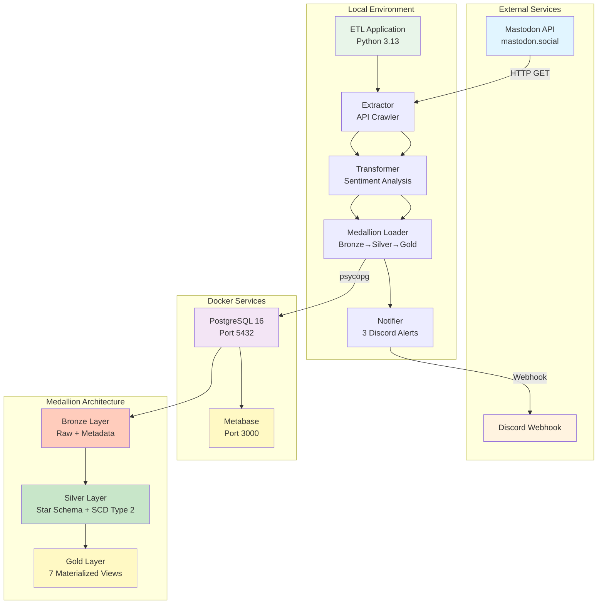
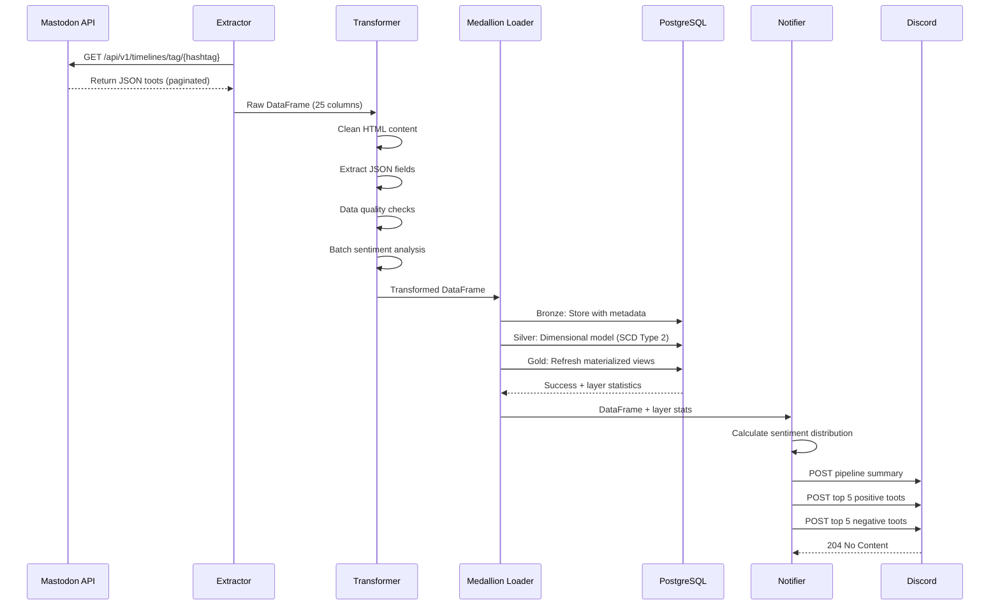
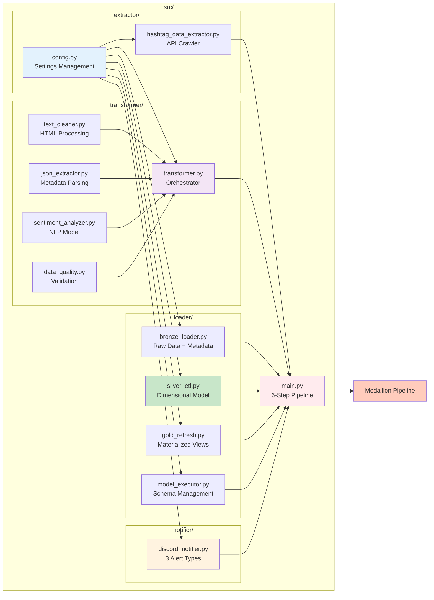
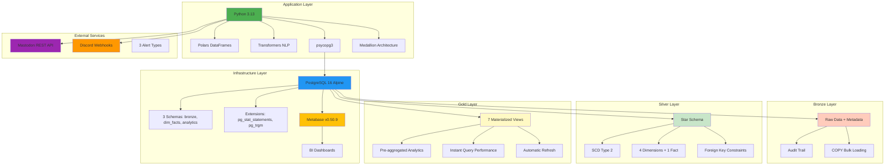

# Mastodon Data Pipeline

> A production-ready ETL pipeline for extracting, transforming, and analyzing Mastodon social media data with sentiment analysis and real-time Discord notifications.

[](https://www.python.org/downloads/)
[](https://www.postgresql.org/)
[](https://docs.docker.com/compose/)

## Table of Contents

- [Overview](#overview)
- [Architecture](#architecture)
- [Features](#features)
- [Quick Start](#quick-start)
- [Configuration](#configuration)
- [Usage](#usage)
- [Project Structure](#project-structure)
- [Development](#development)
- [Data Schema](#data-schema)
- [Troubleshooting](#troubleshooting)
- [Performance](#performance)
- [Security](#security)
- [Contributing](#contributing)
- [License](#license)
- [Support](#support)
- [Architecture for System Architects](#architecture-for-system-architects)

---

## Overview

This ETL pipeline extracts toots (posts) from Mastodon's public API, performs sentiment analysis using state-of-the-art NLP models, and stores the enriched data in PostgreSQL using **Medallion Architecture** (Bronze-Silver-Gold layers) for visualization with Metabase. The system includes automated Discord notifications with comprehensive sentiment alerts.

### Key Capabilities

- **Extract**: Fetch toots from any Mastodon instance via REST API
- **Transform**: Clean HTML, extract metadata, analyze sentiment (Positive/Negative/Neutral)
- **Load**: **Medallion Architecture** with Bronze (raw) → Silver (dimensional) → Gold (analytics) layers
- **Analytics**: Star schema with SCD Type 2, 7 materialized views, real-time sentiment monitoring
- **Notify**: 3 Discord alerts - pipeline summary, positive toots, negative toots

### 🏗️ Medallion Architecture

This project implements a **Bronze-Silver-Gold** data lakehouse pattern:

- **🥉 Bronze Layer**: Raw transformed data with full audit trail and metadata tracking
- **🥈 Silver Layer**: Star schema dimensional model with SCD Type 2 historical tracking
- **🥇 Gold Layer**: 7 pre-aggregated materialized views optimized for analyst queries

---

## Architecture

### System Architecture



### Data Pipeline Flow



### Module Architecture



---

## Features

### ✅ Data Extraction
- Fetch toots from any Mastodon instance
- Configurable time windows (hours/days)
- Pagination with automatic retry logic
- Rate limit handling
- Comprehensive field extraction (25 raw + 24 transformed = 49 total columns)

### ✅ Data Transformation
- **Text Cleaning**: Remove HTML while preserving emojis
- **JSON Parsing**: Extract tags, mentions, media metadata
- **Sentiment Analysis**: 
  - Model: Cardiff NLP Twitter RoBERTa
  - GPU/CPU auto-detection
  - Batch processing (32 texts/batch)
  - Confidence scoring (0-1)
- **Data Quality**: Validation, deduplication, type enforcement

### ✅ Medallion Architecture Implementation
- **Bronze Layer**: Raw transformed data with complete audit trail and metadata tracking
- **Silver Layer**: Star schema dimensional model with SCD Type 2 historical tracking
  - 4 dimension tables: `dim_date`, `dim_account`, `dim_content`, `dim_sentiment`
  - 1 fact table: `fact_toot_engagement` with foreign key relationships
  - Account influence tiers: Micro/Mid/Macro/Mega based on followers
- **Gold Layer**: 7 pre-aggregated materialized views for instant analytics
  - `mv_daily_engagement_summary` - Daily metrics and sentiment trends
  - `mv_top_performing_content` - Top 1000 toots by engagement
  - `mv_account_influence_analysis` - Account performance metrics
  - `mv_hashtag_performance` - Hashtag analytics and trending scores
  - `mv_hourly_posting_patterns` - Optimal posting time identification
  - `mv_sentiment_trends` - Sentiment changes over time
  - `mv_viral_content_indicators` - Viral content identification
- PostgreSQL integration with 3 schemas: `bronze`, `dim_facts`, `analytics`
- Efficient COPY bulk insert with automatic deduplication
- Automatic schema/table creation and migration management

### ✅ Advanced Analytics
- **Star Schema**: Optimized for analytical queries with proper foreign keys
- **SCD Type 2**: Historical account tracking with validity periods
- **Materialized Views**: Pre-aggregated data for instant query performance
- **Influence Analysis**: Account categorization and engagement metrics
- **Sentiment Monitoring**: Real-time sentiment distribution and trends
- **Viral Detection**: Automated identification of high-engagement content
- **Temporal Patterns**: Hourly and daily posting analysis

### ✅ Production Ready
- Comprehensive error handling
- Logging (console + file)
- Docker orchestration
- Configuration management
- Health checks
- Resource limits

---

## Quick Start

### Prerequisites

```bash
# Required
- Python 3.13+
- Docker & Docker Compose
- PostgreSQL (via Docker)

# Optional
- Discord webhook URL (for notifications)
```

### Installation

```bash
# 1. Clone repository
cd week-4-project

# 2. Create virtual environment
python -m venv .venv
source .venv/bin/activate  # On Windows: .venv\Scripts\activate

# 3. Install dependencies
make install
# OR: pip install -r requirements.txt

# 4. Configure settings
# Edit settings.env with your configuration

# 5. Start Docker services
make start

# 6. Run ETL pipeline
make run-etl
```

### First Run

```bash
# Complete setup (for new developers)
make quickstart

# This will:
# - Install Python dependencies
# - Start PostgreSQL and Metabase
# - Wait for services to initialize
# - Display access URLs
```

---

## Configuration

All configuration is managed through `settings.env`:

```bash
# Mastodon API
MASTODON_BASE_URL=https://mastodon.social
API_TIMEOUT=30
HASHTAG=ai
TIME_PERIOD_UNIT=days
TIME_PERIOD_VALUE=2
TOOTS_LIMIT_PER_PAGE=40

# Sentiment Analysis
SENTIMENT_MODEL_NAME=cardiffnlp/twitter-roberta-base-sentiment-latest
SENTIMENT_MODEL_THRESHOLD=0.75

# Discord Notifications (3 alerts)
NOTIFY_VIA_DISCORD=true
DISCORD_WEBHOOK_URL=https://discord.com/api/webhooks/...

# PostgreSQL Database
DATABASE_NAME=mastodon_toots
DATABASE_USER=postgres
DATABASE_PASSWORD=postgres
DATABASE_HOST=localhost
DATABASE_PORT=5432

# Medallion Architecture Schemas
BRONZE_DATABASE_SCHEMA_NAME=bronze
BRONZE_DATABASE_TABLE_NAME=transformed_toots_with_sentiment_data
SILVER_DATABASE_SCHEMA_NAME=dim_facts
GOLD_DATABASE_SCHEMA_NAME=analytics
```

---

## Usage

### Makefile Commands

```bash
# View all commands
make help

# Docker Services
make start              # Start PostgreSQL and Metabase
make stop               # Stop all services
make restart            # Restart services
make status             # Show service status
make logs               # View all logs
make logs-postgres      # View PostgreSQL logs
make logs-metabase      # View Metabase logs

# Medallion Architecture Pipeline
make run-etl            # Run complete 6-step Medallion pipeline
make pipeline           # Start services + run Medallion pipeline

# Database Operations
make psql               # Connect to PostgreSQL
make db-query SQL='...' # Run SQL query
make backup             # Backup database
make restore FILE=...   # Restore from backup
make clean              # Remove all data (WARNING)
make reset              # Reset services (keep data)

# Development
make verify             # Verify all components
make verify-loader      # Verify Medallion loaders
make install            # Install dependencies
make quickstart         # Complete setup for new developers
```

### Manual Execution

```bash
# Activate virtual environment
source .venv/bin/activate

# Run complete 6-step Medallion pipeline
python src/main.py

# Apply models only (for development)
python -c "from loader import ModelExecutor; ModelExecutor().apply_all_models()"

# Test individual loaders
python -c "from loader import BronzeLayerLoader, SilverLayerETL, GoldLayerRefresh; print('All loaders imported successfully')"
```

### Accessing Services

| Service | URL | Credentials |
|---------|-----|-------------|
| PostgreSQL | `localhost:5432` | User: `postgres` / Pass: `postgres` |
| Metabase | `http://localhost:3000` | Create account on first access |

### Metabase Setup

1. Open http://localhost:3000
2. Create admin account
3. Add database connection:
   - **Type**: PostgreSQL
   - **Host**: `postgres` (container name)
   - **Port**: `5432`
   - **Database**: `mastodon_toots`
   - **Username**: `postgres`
   - **Password**: `postgres`
4. **Connect to Analytics Schema**: Use `analytics` schema for pre-aggregated data
5. **Explore Materialized Views**: Query the 7 optimized views for instant analytics
6. **Create Dashboards**: Build visualizations from Gold layer data

---

## Project Structure

```
week-4-project/
├── models/                              # SQL model files for Medallion Architecture
│   ├── bronze/                          # Bronze layer schemas and tables
│   │   ├── 01_create_bronze_schema.sql
│   │   └── 02_create_bronze_tables.sql
│   ├── silver/                          # Silver layer dimensional model
│   │   ├── 01_create_silver_schema.sql
│   │   ├── 02_create_dimension_tables.sql
│   │   └── 03_create_fact_tables.sql
│   └── gold/                            # Gold layer materialized views
│       ├── 01_create_gold_schema.sql
│       └── 02_create_materialized_views.sql
├── src/
│   ├── extractor/
│   │   ├── config.py                    # Configuration management with validation
│   │   └── hashtag_data_extractor.py    # Mastodon API crawler with retry logic
│   ├── transformer/
│   │   ├── text_cleaner.py              # HTML cleaning and text normalization
│   │   ├── json_extractor.py            # JSON field extraction and parsing
│   │   ├── sentiment_analyzer.py        # NLP sentiment analysis with batch processing
│   │   ├── data_quality.py              # Validation and quality checks
│   │   └── transformer.py               # Main transformation orchestrator
│   ├── loader/                          # Medallion Architecture data loaders
│   │   ├── bronze_loader.py             # Bronze layer loader with metadata tracking
│   │   ├── silver_etl.py                # Silver ETL with SCD Type 2 implementation
│   │   ├── gold_refresh.py              # Gold layer materialized view refresher
│   │   ├── model_executor.py             # SQL model application and schema management
│   │   └── __init__.py                  # Loader module exports
│   ├── notifier/
│   │   └── discord_notifier.py          # 3 Discord alert types with rich embeds
│   └── main.py                          # 6-step Medallion pipeline orchestration
├── docker-compose.yml                    # Docker services with model mounting
├── Makefile                              # Command automation with Medallion commands
├── settings.env                          # Configuration with layer schemas
├── requirements.txt                      # Python dependencies
└── README.md                             # This file
```

### Key Files

| File | Purpose |
|------|---------|
| `src/main.py` | 6-step Medallion pipeline orchestration |
| `src/loader/silver_etl.py` | Star schema dimensional model with SCD Type 2 |
| `src/loader/bronze_loader.py` | Bronze layer with audit trail and metadata |
| `src/loader/gold_refresh.py` | 7 materialized views for analytics |
| `src/notifier/discord_notifier.py` | 3 Discord alerts (summary, positive, negative) |
| `models/` | Complete SQL models for all 3 layers |

---

## Development

### Adding New Features

```python
# 1. Create new module in appropriate directory
src/transformer/new_feature.py

# 2. Implement with proper docstrings
class NewFeature:
    """
    Brief description of what this feature does.
    
    Attributes:
        param1 (type): Description of param1
        
    Methods:
        process(): Main processing method
    """
    
    def process(self, data):
        """
        Process the input data.
        
        Args:
            data (DataFrame): Input data to process
            
        Returns:
            DataFrame: Processed data
            
        Raises:
            ValueError: If data is invalid
        """
        pass

# 3. Import in transformer.py
from .new_feature import NewFeature

# 4. Integrate into pipeline
# 5. Add tests
# 6. Update documentation
```

### Testing

```bash
# Verify refactored modules
make verify

# Test database loader
make verify-loader

# Run full pipeline with test data
make run-etl
```

### Code Quality

All modules include:
- ✅ Type hints
- ✅ Comprehensive docstrings (Google/NumPy style)
- ✅ Error handling with logging
- ✅ Input validation
- ✅ Unit test compatibility

### Logging

Logs are written to:
- **Console**: Real-time output
- **File**: `pipeline_YYYYMMDD_HHMMSS.log`

Configure logging level in `src/main.py`:
```python
logging.basicConfig(level=logging.INFO)  # Change to DEBUG for verbose
```

---

## Data Schema

### Database Schema: Medallion Architecture

#### 🥉 Bronze Layer Schema
**Schema**: `bronze` (Raw transformed data with audit trail)

**Primary Table**: `transformed_toots_with_sentiment_data` (49 columns)
- Complete raw data preservation with all original fields
- Metadata tracking: `ingestion_timestamp`, `pipeline_run_id`, `data_version`
- Efficient COPY loading with upsert capability

#### 🥈 Silver Layer Schema
**Schema**: `dim_facts` (Star schema dimensional model)

**4 Dimension Tables**:
- `dim_date` (12 columns) - Time dimension with date keys
- `dim_account` (15 columns) - Account dimension with SCD Type 2
- `dim_content` (19 columns) - Content metadata dimension
- `dim_sentiment` (5 columns) - Sentiment analysis dimension

**1 Fact Table**:
- `fact_toot_engagement` (14 columns) - Core metrics with FK relationships

#### 🥇 Gold Layer Schema
**Schema**: `analytics` (Pre-aggregated materialized views)

**7 Materialized Views**:
- `mv_daily_engagement_summary` - Daily aggregated metrics
- `mv_top_performing_content` - Top 1000 toots by engagement
- `mv_account_influence_analysis` - Account performance metrics
- `mv_hashtag_performance` - Hashtag analytics and trending
- `mv_hourly_posting_patterns` - Optimal posting times
- `mv_sentiment_trends` - Sentiment changes over time
- `mv_viral_content_indicators` - Viral content identification

**Key Features**:
- 25+ optimized indexes across all tables
- Foreign key constraints for data integrity
- SCD Type 2 for historical account tracking
- Automatic materialized view refresh after data updates

---

## Troubleshooting

### Common Issues

**Issue**: PostgreSQL won't start
```bash
# Check logs
make logs-postgres

# Ensure port 5432 is free
lsof -i :5432

# Reset services
make reset
```

**Issue**: Medallion models won't apply
```bash
# Check PostgreSQL connection
make psql

# Apply models manually
python -c "from loader import ModelExecutor; ModelExecutor().apply_all_models()"

# Check model file syntax
python -c "from loader import ModelExecutor; executor = ModelExecutor(); print(executor.verify_schemas())"
```

**Issue**: Silver layer ETL fails with duplicates
```bash
# Check for duplicate toots in Bronze
docker-compose exec postgres psql -U postgres -d mastodon_toots -c "
SELECT id, COUNT(*) as cnt
FROM bronze.transformed_toots_with_sentiment_data
GROUP BY id HAVING COUNT(*) > 1
LIMIT 5;"

# The system now handles duplicates automatically with deduplication
```

**Issue**: Materialized views are empty
```bash
# Refresh Gold layer
python -c "from loader import GoldLayerRefresh; GoldLayerRefresh().refresh_all_views()"

# Check view statistics
docker-compose exec postgres psql -U postgres -d mastodon_toots -c "\dt+ analytics.*"
```

**Issue**: Discord notifications not working
```bash
# Check webhook URL in settings.env
cat settings.env | grep DISCORD

# Test individual notification types
python -c "from notifier import DiscordNotifier; notifier = DiscordNotifier(); print(f'Enabled: {notifier.enabled}')"
```

**Issue**: Out of disk space
```bash
# Clean old data
make clean

# Remove unused Docker resources
docker system prune -a --volumes
```

### Debug Mode

Enable verbose logging:
```python
# In src/main.py
logging.basicConfig(level=logging.DEBUG)
```

View all SQL queries:
```python
# In src/loader/bronze_loader.py or src/loader/silver_etl.py
logger.setLevel(logging.DEBUG)
```

---

## Performance

### Performance Benchmarks

| Pipeline Step | Duration | Description |
|---------------|----------|-------------|
| **Step 0**: Apply Models | 1-3 seconds | Create schemas and tables |
| **Step 1**: Extract Data | 2-8 minutes | API pagination (depends on hashtag popularity) |
| **Step 2**: Transform | 10-30 seconds | HTML cleaning + sentiment analysis |
| **Step 3**: Load to Bronze | 5-15 seconds | Bulk COPY with deduplication |
| **Step 4**: Populate Silver | 15-45 seconds | Dimensional model + SCD Type 2 |
| **Step 5**: Refresh Gold | 2-5 seconds | Update 7 materialized views |
| **Step 6**: Notifications | 1-2 seconds | 3 Discord alerts |
| **Total Pipeline** | **3-10 minutes** | Complete Medallion architecture |

### Performance Optimizations

1. **GPU Acceleration** for sentiment analysis:
   ```python
   # src/transformer/sentiment_analyzer.py - automatic detection
   # NVIDIA GPU: Install CUDA + PyTorch GPU
   # Apple Silicon: MPS enabled automatically
   # CPU fallback: Optimized for batch processing
   ```

2. **Database Tuning** for Medallion Architecture:
   ```sql
   -- PostgreSQL configuration for analytics workloads
   shared_buffers = 256MB      # Bronze/Silver layer queries
   work_mem = 16MB             # Complex aggregations
   effective_cache_size = 1GB  # Gold layer materialized views
   ```

3. **Query Optimization**:
   - Pre-aggregated materialized views (Gold layer)
   - Indexed foreign keys (Silver layer)
   - Partitioned time-based queries (Bronze layer)
   - Automatic deduplication prevents redundant processing

---

## Security

### Production Checklist

- [ ] Change default PostgreSQL password
- [ ] Use environment variables for secrets
- [ ] Enable PostgreSQL SSL connections
- [ ] Restrict Docker network exposure
- [ ] Regular database backups (`make backup`)
- [ ] Update dependencies regularly
- [ ] Monitor Discord webhook usage
- [ ] Review logs for anomalies

### Best Practices Implemented

✅ Non-root Docker users  
✅ Resource limits (CPU/Memory)  
✅ Health checks for services  
✅ Encrypted password authentication  
✅ Configuration validation  
✅ Logging with rotation  
✅ Network isolation  

---

## Contributing

### Development Workflow

1. Create feature branch
2. Implement changes with docstrings
3. Test with `make verify`
4. Update README if needed
5. Submit pull request

### Code Style

- **Python**: PEP 8
- **Docstrings**: Google style
- **Type hints**: Required for public methods
- **Logging**: Use module-level logger

---

## License

This project is for educational purposes. Mastodon API usage subject to instance terms of service.

---

## Support

For issues and questions:
1. Check [Troubleshooting](#troubleshooting) section
2. Review logs: `make logs`
3. Verify configuration: `cat settings.env`
4. Test components: `make verify`

---

## Architecture for System Architects

### Technology Stack



### Design Decisions

| Decision | Rationale |
|----------|-----------|
| **Medallion Architecture** | Industry-standard Bronze/Silver/Gold pattern for data quality and performance |
| **Star Schema** | Optimized for analytical queries with proper dimensional modeling |
| **SCD Type 2** | Historical tracking of account changes with validity periods |
| **Materialized Views** | Pre-aggregated data for instant analytics performance |
| **Polars over Pandas** | 10-100x faster, better memory efficiency, lazy evaluation |
| **psycopg3 over SQLAlchemy** | Direct control, better performance for bulk operations |
| **Modular Architecture** | 4 specialized loaders vs monolithic design |
| **COPY with Deduplication** | PostgreSQL COPY is 10x faster with automatic duplicate handling |
| **Batch Sentiment Processing** | 32 texts/batch balances speed and memory usage |
| **Cardiff NLP RoBERTa** | State-of-art for social media sentiment (124M tweets trained) |

### Scalability Considerations

**Current**: Single-machine, on-demand execution with Medallion Architecture
**Scale to 1M+ toots**:
- **Bronze Layer**: Partition by time, implement data retention policies
- **Silver Layer**: Add partitioning, distributed dimensional processing
- **Gold Layer**: Incremental materialized view refresh, query optimization
- **Infrastructure**: Read replicas, connection pooling, caching layers
- **Orchestration**: Move to distributed systems (Airflow, Prefect)

### Monitoring & Observability

- Logging: File + Console (JSON format recommended for production)
- Metrics: PostgreSQL query performance via pg_stat_statements
- Alerts: Discord webhooks for sentiment anomalies
- Health: Docker healthchecks for services

---

**Built with ❤️ for Mastodon data analysis using Medallion Architecture**

